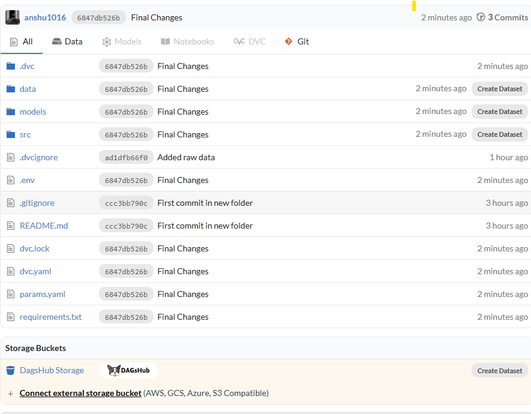
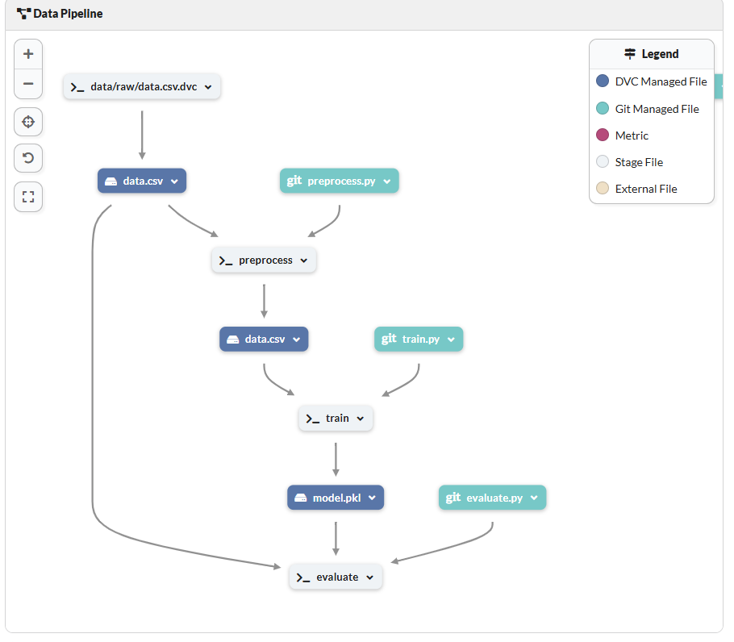

### Project: Data Pipeline with DVC and MLflow for Machine Learning
This project demonstrates how to build an end-to-end machine learning pipeline using DVC (Data Version Control) for data and model versioning, and MLflow for experiment tracking. The pipeline focuses on training a Random Forest Classifier on the Pima Indians Diabetes Dataset, with clear stages for data preprocessing, model training, and evaluation.

graph TD;
    A[Raw Data] --> B[DVC Versioned]
    B --> C[Preprocessing Script]
    C --> D[Train Model]
    D --> E[MLflow Logging]
    E --> F[Model Saved via DVC]

Key Features of the Project:
Data Version Control (DVC):

DVC is used to track and version the dataset, models, and pipeline stages, ensuring reproducibility across different environments.
The pipeline is structured into stages (preprocessing, training, evaluation) that can be automatically re-executed if any dependencies change (e.g., data, scripts, or parameters).
DVC also allows remote data storage (e.g., DagsHub, S3) for large datasets and models.
Experiment Tracking with MLflow:
> 

> 

> 
MLflow is used to track experiment metrics, parameters, and artifacts.
It logs the hyperparameters of the model (e.g., n_estimators, max_depth) and performance metrics like accuracy.
MLflow helps compare different runs and models to optimize the machine learning pipeline.
Pipeline Stages:
Preprocessing:

The preprocess.py script reads the raw dataset (data/raw/data.csv), performs basic preprocessing (such as renaming columns), and outputs the processed data to data/processed/data.csv.
This stage ensures that data is consistently processed across runs.
Training:

The train.py script trains a Random Forest Classifier on the preprocessed data.
The model is saved as models/random_forest.pkl.
Hyperparameters and the model itself are logged into MLflow for tracking and comparison.
Evaluation:

The evaluate.py script loads the trained model and evaluates its performance (accuracy) on the dataset.
The evaluation metrics are logged to MLflow for tracking.
Goals:
Reproducibility: By using DVC, the pipeline ensures that the same data, parameters, and code can reproduce the same results, making the workflow reliable and consistent.
Experimentation: MLflow allows users to easily track different experiments (with varying hyperparameters) and compare the performance of models.
Collaboration: DVC and MLflow enable smooth collaboration in a team environment, where different users can work on the same project and track changes seamlessly.
Use Cases:
Data Science Teams: Teams can use this project setup to track datasets, models, and experiments in a reproducible and organized manner.
Machine Learning Research: Researchers can quickly iterate over different experiments, track performance metrics, and manage data versions effectively.
Technology Stack:
Python: The core programming language for data processing, model training, and evaluation.
DVC: For version control of data, models, and pipeline stages.
MLflow: For logging and tracking experiments, metrics, and model artifacts.
Scikit-learn: For building and training the Random Forest Classifier.
This project demonstrates how to manage the lifecycle of a machine learning project, ensuring that data, code, models, and experiments are all tracked, versioned, and reproducible.

### For Adding Stages

dvc stage add -n preprocess \
    -p preprocess.input,preprocess.output \
    -d src/preprocess.py -d data/raw/data.csv \
    -o data/processed/data.csv \
    python src/preprocess.py
	
	
dvc stage add -n train \
    -p train.data,train.model,train.random_state,train.n_estimators,train.max_depth \
    -d src/train.py -d data/raw/data.csv \
    -o models/model.pkl \
    python src/train.py
	
dvc stage add -n evaluate \
    -d src/evaluate.py -d models/model.pkl -d data/raw/data.csv \
    python src/evaluate.py

